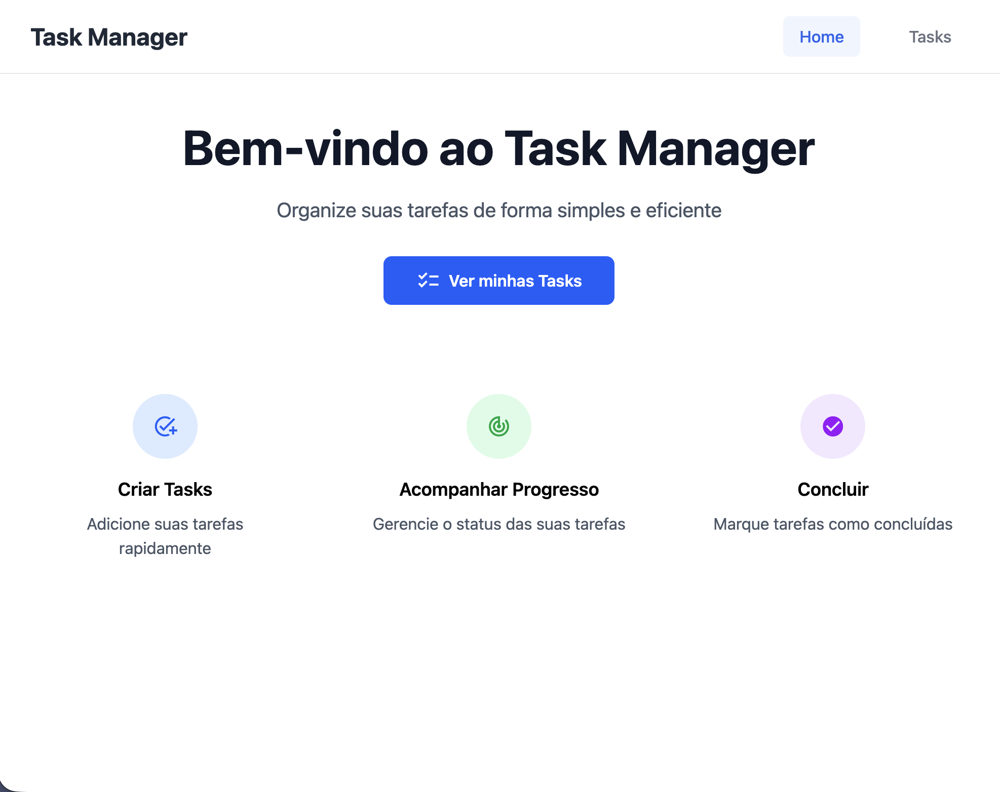
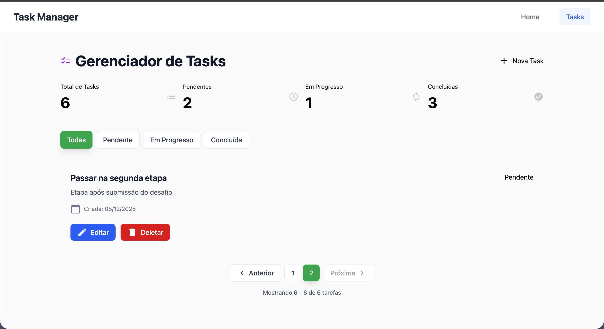

# jtech-tasklist-frontend

## Visão Geral

Aplicação web moderna para gerenciamento de tarefas desenvolvida com Vue 3, TypeScript e Tailwind CSS. Interface responsiva e intuitiva que consome a API REST do backend para fornecer uma experiência completa de CRUD de tarefas com paginação.

### Objetivos
- Fornecer interface amigável para gerenciar tarefas
- Implementar boas práticas de desenvolvimento frontend
- Garantir responsividade e acessibilidade
- Consumir API REST com validação e tratamento de erros

---

## Screenshots

### Tela Inicial


### Visualização de Tarefas com Modal


### Paginação de Tarefas


---

## Stack Utilizada

| Tecnologia | Versão | Propósito |
|-----------|--------|----------|
| Vue | 3.5.18 | Framework JavaScript |
| TypeScript | 5.8.0 | Tipagem estática |
| Vite | 7.0.6 | Build tool e dev server |
| Vue Router | 4.5.1 | Roteamento SPA |
| Pinia | 3.0.3 | Gerenciamento de estado |
| Tailwind CSS | 4.1.17 | Framework CSS |
| Axios | 1.13.2 | Cliente HTTP |
| Vitest | 3.2.4 | Framework de testes |
| Vue Test Utils | 2.4.6 | Utilitários para testes |
| ESLint | 9.31.0 | Linter |
| Prettier | 3.6.2 | Formatação de código |
| PostCSS | 8.5.6 | Processamento CSS |

---

## Como Rodar Localmente

### Pré-requisitos
- Node.js 20.19.0+ ou 22.12.0+
- npm ou yarn
- Backend rodando em `http://localhost:8080`

### Passos de Configuração

1. Clone o repositório
   ```bash
   git clone <repository-url>
   cd jtech-tasklist-frontend
   ```

2. Instale as dependências
   ```bash
   npm install
   ```

3. Configure as variáveis de ambiente (opcional)
   ```typescript
   // src/services/HttpFactory.ts já está configurado para localhost:8080
   const API_BASE_URL = 'http://localhost:8080/api/v1'
   ```

4. Execute o projeto em modo desenvolvimento
   ```bash
   npm run dev
   ```

5. Acesse a aplicação
   ```
   http://localhost:5173
   ```

---

## Estrutura de Pastas

```
src/
├── assets/              # Arquivos estáticos (CSS, imagens)
│   └── main.css        # Estilos globais
├── components/          # Componentes reutilizáveis
│   ├── ConfirmModal.vue
│   ├── TaskCreateModal.vue
│   ├── TaskEditModal.vue
│   └── ToastNotification.vue
├── composables/         # Composables Vue
│   └── useToast.ts
├── router/              # Configuração de rotas
│   └── index.ts
├── services/            # Serviços e APIs
│   ├── HttpFactory.ts
│   └── TaskApiService.ts
├── stores/              # Gerenciamento de estado (Pinia)
│   └── taskStore.ts
├── utils/               # Utilitários
│   └── errorHandler.ts
├── views/               # Páginas/Views
│   ├── HomeView.vue
│   ├── NotFoundView.vue
│   └── TasksView.vue
├── App.vue              # Componente raiz
└── main.ts              # Entry point
```

---

## Decisões Técnicas

### Vue 3 Composition API
- API mais moderna e flexível
- Melhor reutilização de lógica com composables
- Type inference superior com TypeScript
- Benefício: Código mais organizado e testável

### TypeScript
- Tipagem estática reduz bugs em runtime
- Melhor IntelliSense e autocomplete
- Refatoração segura
- Documentação implícita no código

### Pinia para State Management
- Store oficial do Vue 3
- API mais simples que Vuex
- Suporte nativo a TypeScript
- DevTools integrado

### Tailwind CSS
- Utility-first CSS framework
- Desenvolvimento rápido e consistente
- Bundle otimizado (purge de classes não utilizadas)
- Responsividade fácil com breakpoints

### Axios para HTTP
- API intuitiva e promise-based
- Interceptors para tratamento global de erros
- Configuração centralizada
- Suporte a cancelamento de requisições

### Vite como Build Tool
- Extremamente rápido (HMR instantâneo)
- Build otimizado com Rollup
- Suporte nativo a TypeScript e JSX
- Plugins Vue oficiais

### Componentização Modular
- Componentes pequenos e reutilizáveis
- Props tipadas com TypeScript
- Emits explícitos
- Separação clara de responsabilidades

### Toast Notifications
- Feedback visual para ações do usuário
- Composable reutilizável (useToast)
- Auto-dismiss configurável
- Tipos: success, error, info

### Modal System
- Componentes modais para criar/editar tarefas
- Overlay com backdrop
- Acessibilidade (ESC para fechar)
- Validação de formulários

---

## Funcionalidades

### Gerenciamento de Tarefas
```typescript
// Criar nova tarefa
- Modal com formulário validado
- Campos: nome, descrição, status

// Listar tarefas
- Visualização em cards
- Paginação (20 itens por página)
- Indicadores visuais por status

// Editar tarefa
- Modal pré-preenchido
- Atualização em tempo real

// Deletar tarefa
- Modal de confirmação
- Soft delete no backend
```

### Status de Tarefas
- **PENDING** - Pendente (badge cinza)
- **IN_PROGRESS** - Em progresso (badge amarelo)
- **COMPLETED** - Completada (badge verde)

### Paginação
- Controles de navegação (anterior/próxima)
- Indicador de página atual
- Total de itens
- Navegação numérica de páginas

---

## Rotas da Aplicação

```typescript
/ (HomeView)
- Página inicial com introdução

/tasks (TasksView)
- Listagem de tarefas
- CRUD completo
- Paginação

/404 (NotFoundView)
- Página de erro para rotas inexistentes
```

---

## Melhorias Futuras

### Curto Prazo
- Filtros avançados (status, data)
- Busca por nome/descrição
- Ordenação customizável
- Loading states melhorados
- Skeleton loaders

### Médio Prazo
- Autenticação de usuários (JWT)
- Drag and drop para reordenar
- Dark mode
- Testes E2E com Playwright
- Animações e transições
- Offline mode (PWA)

### Longo Prazo
- Colaboração em tempo real (WebSocket)
- Comentários em tarefas
- Anexos de arquivos
- Notificações push
- Dashboard com gráficos
- Mobile app (Capacitor)
- Múltiplos idiomas (i18n)

---

## Troubleshooting

### Erro ao conectar com backend
```bash
# Verificar se backend está rodando
curl http://localhost:8080/api/v1/tasks

# Verificar configuração em HttpFactory.ts
# Deve apontar para http://localhost:8080/api/v1
```

### Dependências não instaladas
```bash
# Limpar cache do npm
npm cache clean --force

# Remover node_modules e reinstalar
rm -rf node_modules package-lock.json
npm install
```

### Build falha
```bash
# Verificar erros de TypeScript
npm run type-check

# Limpar cache do Vite
rm -rf node_modules/.vite
npm run dev
```

### Testes falhando
```bash
# Executar com mais verbosidade
npm run test:unit -- --reporter=verbose

# Executar teste específico
npm run test:unit -- TasksView.spec.ts
```

---

## Docker

### Build da imagem
```bash
docker build -t jtech-tasklist-frontend .
```

### Executar container
```bash
docker run -p 80:80 jtech-tasklist-frontend
```

### Docker Compose (com backend)
```bash
# Na raiz do projeto
docker-compose up -d
```

---

## Licença

Propriedade J-Tech

---

## Desenvolvimento

Framework: Vue 3.5.18
TypeScript Version: 5.8.0
Build Tool: Vite 7.0.6
Arquitetura: Composition API + Pinia